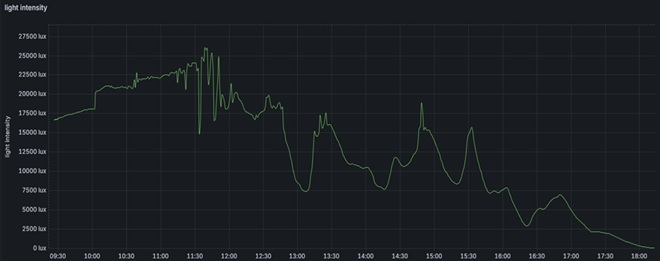

# ESP32 IoT Light Monitoring System

Project developed as part of my university degree.

<p align="center">
  
  
</p>

A complete IoT system based on ESP32, MQTT (TLS), a Python backend client, and InfluxDB.

The project consists of two main parts:

- **Light Probe** – ESP32 integrated with a VEML7700 light sensor  
- **Server** – MQTT broker, Python client, InfluxDB, and Grafana  

The ESP32 reads light intensity from a VEML7700 sensor and publishes data securely via MQTT within a local Wi-Fi network.  
A Python client subscribes to the MQTT topic and stores the data in InfluxDB.

---

## 📊 Measurement Results

<p align="center">
  
</p>

The figure above presents real-time light intensity measurements
collected by the ESP32 probe, stored in InfluxDB,
and visualized using Grafana.

---

## 🎯 System Requirements and Design Goals

The system was developed to achieve the following engineering objectives:

- Continuous acquisition of high-precision light intensity measurements
- Robust and reliable wireless communication over MQTT
- Fault tolerance against temporary Internet connection loss
- Firmware optimized for embedded, resource-constrained hardware environments
- Runtime control of probe operation via a command interface (CMD module)
- Efficient memory utilization and power management
- Visual indication of probe operating status (power and server connectivity LEDs)
- Secure data transmission using TLS encryption and authenticated access
- Centralized aggregation of measurement data in a time-series database (InfluxDB)
- Real-time graphical visualization of sensor data (Grafana)

---

## 🏗 System Architecture

→ ESP32-DevKitV1 (VEML7700)  
→ MQTT Mosquitto Broker (TLS, port 8883)  
→ Python MQTT Client, paho-mqtt    
→ InfluxDB
→ Grafana (data visualization)

<p align="center">
  
</p>


## 📁 Project Structure
```
ESP32-Projekt/
│
├── esp_32_firmware/
│
├── main/
│   ├── app_main.c              # Application entry point
│   ├── CMakeLists.txt
│   ├── idf_component.yml       # Component metadata and dependencies
    └── Kconfig.projbuild       # Custom menuconfig options
│
├── components/
│   ├── wifi/                   # Wi-Fi connection management
│   ├── mqtt_conn/              # Secure MQTT communication (TLS)
│   │   └── certs/
│   │       └── ca.crt          # CA certificate for broker verification
│   ├── veml7700/               # Light sensor driver (I2C)
│   ├── led/                    # Status LED control
│   ├── app_sntp/               # Time synchronization (NTP)
    └── cmd/                    # Command interface
│
├── CMakeLists.txt              # Project-level CMake configuration
└── dependencies.lock           # Managed component dependencies
```
# 🔌 ESP32 Firmware
Built on FreeRTOS to support concurrent measurement processing and MQTT communication
The system is divided into three main tasks:

- **task_measure** – responsible for acquiring light intensity measurements from the VEML7700 sensor and timestamping the data.
- **task_send_MQTT** – creates JSON messages, buffers measurement data, and prepares it for transmission.
- **Wi-Fi/MQTT task** – manages network connectivity and handles secure MQTT communication with the server.

Data is transferred between tasks using FreeRTOS queues, ensuring safe inter-task communication and concurrent execution.

<p align="center">
  
</p>

## 🔌 ESP32 Firmware – Features

- Configurable via `idf.py menuconfig`:
  - Wi-Fi settings
  - MQTT settings (host, port, topic, credentials)
  - I2C parameters (SDA/SCL pins, frequency)

- Continuous lux measurement using the VEML7700 sensor (I2C)
- Secure MQTT communication over TLS (broker CA certificate embedded in firmware)
- JSON payload publishing with synchronized timestamp (SNTP-based time synchronization)
- QoS support for reliable message delivery
- Status LED indication (power and server connection state)
- Fault-tolerant behavior during temporary network interruptions
- Runtime probe control and diagnostics via command interface (CMD module)ol and diagnostics via command interface (CMD module)
- System logs

## Example MQTT Payload

```json
{
  "lux": 123.45,
  "time": 2026-02-25 14:37:52
}
```

## 🌐 MQTT Broker – Features

- Central message hub for IoT devices and backend services
- TLS-enabled listener (secure encrypted transport)
- Optional access control (username/password authentication)
- Topic-based message routing (publish/subscribe)
- Supports multiple clients (ESP32 probe + backend consumer)
- Logs and diagnostics for connection and authentication events

## 🐍 Python MQTT Client – Features

- Secure connection to MQTT broker using TLS (CA certificate)
- Topic subscription and real-time message processing
- JSON payload validation and parsing
- Writes measurement data to InfluxDB (time-series database)
- Clear console output for monitoring and debugging
- Configuration separated from code (`config/config.py` from template)
- Designed as a bridge: MQTT → InfluxDB


Each component contains its own detailed README with configuration instructions.

---

## 🔧 Setup Overview

To run the complete system, follow the steps below.

---

### 1️⃣ ESP32 Firmware

Configure and flash the ESP32 firmware.

See detailed instructions in:  
`esp_32_firmware/README.md`

---

### 2️⃣ MQTT Broker & InfluxDB

Ensure that the following services are running:

- MQTT broker (TLS, port 8883)
- InfluxDB 2.x
- Existing bucket and valid write token

---

### 3️⃣ Python Backend Client

Navigate to: `mqtt_client_py/`.
See configuration instructions in:  `mqtt_client_py/README.md`.

### Install dependencies
```
pip install paho-mqtt 
pip install influxdb-client
```

