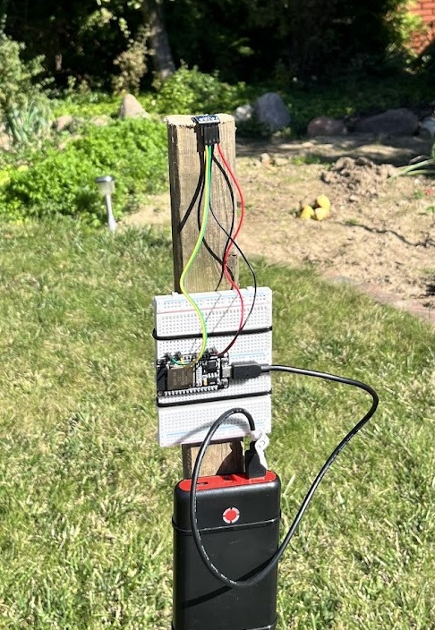
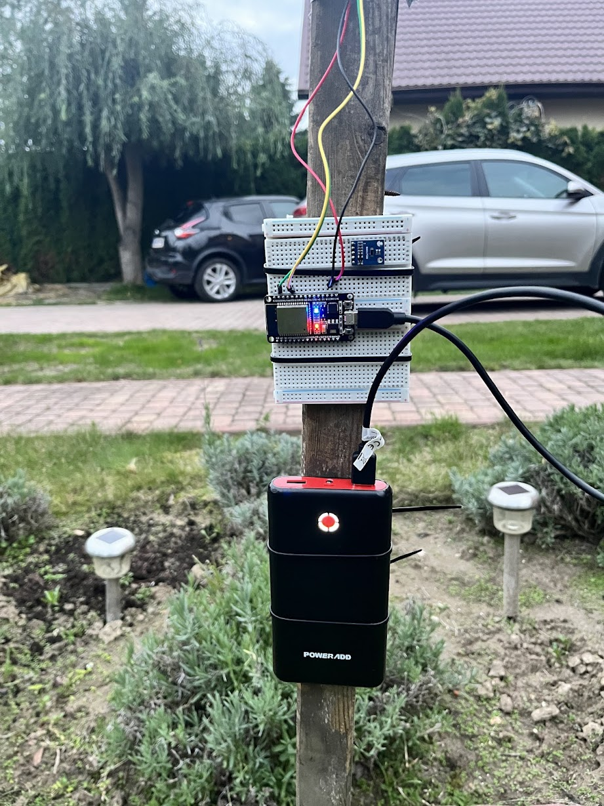

# ESP32 IoT Light Monitoring System

Project developed as part of my university degree.

  


A complete IoT system based on ESP32, MQTT (TLS), a Python backend client, and InfluxDB.

The project consists of two main parts:

- **Light Probe** – ESP32 integrated with a VEML7700 light sensor  
- **Server** – MQTT broker, Python client, InfluxDB, and Grafana  

The ESP32 reads light intensity from a VEML7700 sensor and publishes data securely via MQTT in the local Wi-fi network .
A Python client subscribes to the MQTT topic and stores the data in InfluxDB.


## 🏗 System Architecture

ESP32 (VEML7700)  
→ MQTT Broker (TLS, port 8883)  
→ Python MQTT Client  
→ InfluxDB  

---

## 📁 Project Structure

ESP32-Projekt/
│
├── esp_32_firmware/ # ESP-IDF firmware for ESP32
│
├── MQTT_CLIENT_PY/ # Python MQTT → InfluxDB client
│ ├── mqtt_client.py
│ ├── config/
│ │ ├── config_example.py
│ │ └── README.md
│ ├── certs/
│ │ └── README.md
│ └── README.md
│
└── README.md
# 🔌 ESP32 Firmware

## Features

- Reads lux value from VEML7700 (I2C)
- Publishes JSON payload over MQTT
- Secure TLS connection (port 8883)
- QoS 2 support

## Example MQTT Payload

```json
{
  "lux": 123.45,
  "time": 1710000000
}